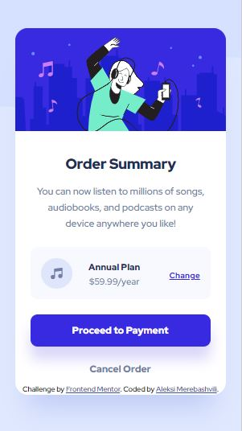
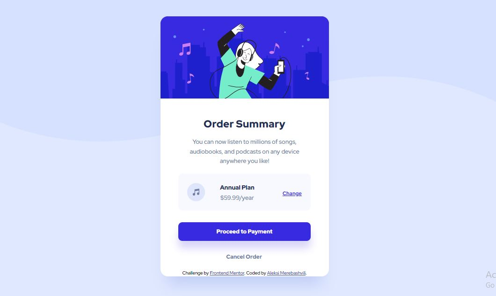

# Frontend Mentor - Order summary card solution

This is a solution to the [Order summary card challenge on Frontend Mentor](https://www.frontendmentor.io/challenges/order-summary-component-QlPmajDUj). Frontend Mentor challenges help you improve your coding skills by building realistic projects. 

## Table of contents

- [Overview](#overview)
  - [The challenge](#the-challenge)
  - [Screenshot](#screenshot)
  - [Links](#links)
- [My process](#my-process)
  - [Built with](#built-with)
  - [What I learned](#what-i-learned)
  - [Continued development](#continued-development)
  - [Useful resources](#useful-resources)
- [Author](#author)
- [Acknowledgments](#acknowledgments)

## Overview

### The challenge

I managed to pass this challnge. Users are be able to see card's mobile and desktop versions. also, they can sees hover states for interactive elements in desktop version. I added footnote to the card with challenge source link and author's name (linked to my Github page)

### Screenshot

This is a screenshot of mobile version ov the card: 

and this is a desktop version: 

### Links

- Solution URL: [Github](https://github.com/Aleqsa123/order-summary)
- Live Site URL: [Github pages](https://aleqsa123.github.io/order-summary/)

## My process

### Built with

- Semantic HTML5 markup
- CSS custom properties
- Flexbox
- Mobile-first workflow
- Media query

### What I learned

This challenge was very important in understanding responsive design. I learned mobile-first workflow and doing breakouts. I also understood "margin: auto;", paddings and box-sizing much better. I studied google fonts import method in CSS.

I love this CSS code because of margin understanding
.main {
    height: 570px;
    width: 327px;
    border-radius: 20px;
    background: #FFFFFF;
    box-shadow: 0px 40px 40px -20px rgba(13, 48, 189, 0.151826);
    margin-top: 71px;
    margin-right: auto;
    margin-bottom: 71px;
    margin-left: auto;
}

and this one, for fonts import learning:
@import url('https://fonts.googleapis.com/css2?family=Red+Hat+Display:wght@500;700;900&display=swap');

Media query code is also important at this stage of study:
@media screen and (min-width: 500px) {
    body {
        background-image: url(./images/pattern-background-desktop.svg);
        background-repeat: no-repeat;
        background-position: top, right;
        Width: 100vw;
    }

### Continued development

Getting data from figma design and use them properly with HTML elements would be great. Also I have to learn more about boxes and how they behave in different "display" situation.

### Useful resources

(https://developer.mozilla.org/en-US/) - This is an amazing site which helped me in styling some text and layout boxes.
(https://www.youtube.com/watch?v=JN4vDtGuDvg&t=558s) - This is also a v-log by Nika, which explains well how to layout card content and to handle responsive design.

## Author
- Fronendmentor - [Aleqsa123] (https://www.frontendmentor.io/profile/Aleqsa123)
- Github - [Aleqsa123](https://github.com/Aleqsa123)
- Linkedin - [Aleksi Merebashvili](https://www.linkedin.com/in/aleksi-merebashvili-36627426/)
- Facebook - [Aleksi Merebashvili](https://www.facebook.com/aleksi.merebashvili)